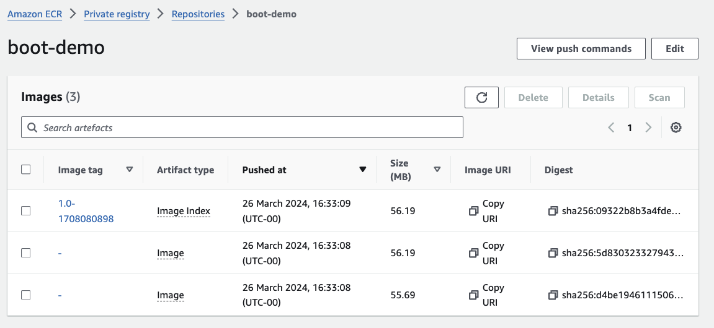
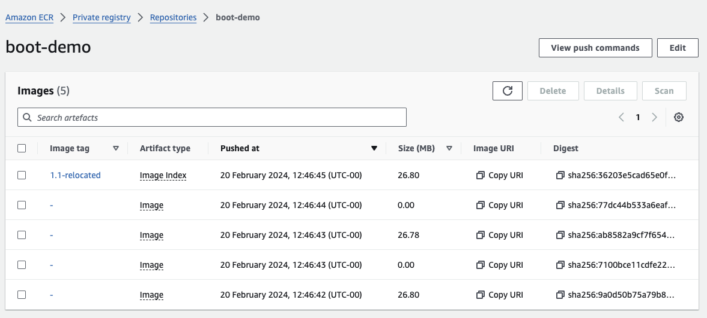

= Building the Multi-Platform OCI Image using Podman

Podman is a rootless and daemonless drop-in replacement for Docker. You can start and stop container, build and push images, and basically everything you can do with Docker.

There are some huge benefits, when it comes to Podman. It is a systemd native, which means you can control your containers with systemd services easily. It has various options to run containers as root or user. Not only that, but it also provides features that don't even exist in Docker, like auto-updates, running Pods and even Kubernetes deployments.

== Install & Run Podman

To start a podman VM automatically at login, also install the cask

[source, shell]
----
brew install podman podman-desktop
----

Init the Podman VM

[source, shell]
----
podman machine init
----

Start  the Podman VM

[source, shell]
----
podman machine start
----

You can then verify the installation information using:

[source, shell]
----
podman info
podman version
----

== Cleanup

Stop & Delete the Podman VM

[source, shell]
----
podman machine stop
podman machine rm
----

== Building the multi-platform and uploading it to Amazon

=== Set up

[source, shell]
----
IMAGE_NAME=boot-demo
REGION=....
AWS_ACCOUNT=...
echo "... login into destination ECR..."
aws ecr get-login-password --region ${REGION} | podman login --username AWS --password-stdin ${AWS_ACCOUNT}.dkr.ecr.${REGION}.amazonaws.com

echo "... create ECR repository ..."
aws ecr create-repository --repository-name boot-demo --image-scanning-configuration scanOnPush=true --region ${REGION}
----

=== Create the multi-arch image

There are two ways to go about it:

* create images for each platform separately and add them to an index manifest (*advantage*: easy to read tags for each architecture type).
[source, shell]
----
echo "... create separate images ..."
podman build --platform linux/arm64 -t "${AWS_ACCOUNT}.dkr.ecr.${REGION}.amazonaws.com/${IMAGE_NAME}:1.0-arm64" .
podman build --platform linux/amd64 -t "${AWS_ACCOUNT}.dkr.ecr.${REGION}.amazonaws.com/${IMAGE_NAME}:1.0-amd64" .

echo "... verify the created images ..."
podman image ls
podman image inspect "${AWS_ACCOUNT}.dkr.ecr.${REGION}.amazonaws.com/${IMAGE_NAME}:1.0-arm64" | grep Arch
podman image inspect "${AWS_ACCOUNT}.dkr.ecr.${REGION}.amazonaws.com/${IMAGE_NAME}:1.0-amd64" | grep Arch

echo "... Push them to ECR..."
podman push "${AWS_ACCOUNT}.dkr.ecr.${REGION}.amazonaws.com/${IMAGE_NAME}:1.0-arm64"
podman push "${AWS_ACCOUNT}.dkr.ecr.${REGION}.amazonaws.com/${IMAGE_NAME}:1.0-amd64"

echo "... create and push manifest for multi-arch image ..."
podman manifest create "${AWS_ACCOUNT}.dkr.ecr.${REGION}.amazonaws.com/${IMAGE_NAME}:1.0"

podman manifest add "${AWS_ACCOUNT}.dkr.ecr.${REGION}.amazonaws.com/${IMAGE_NAME}:1.0" "docker://${AWS_ACCOUNT}.dkr.ecr.${REGION}.amazonaws.com/${IMAGE_NAME}:1.0-amd64"
podman manifest add "${AWS_ACCOUNT}.dkr.ecr.${REGION}.amazonaws.com/${IMAGE_NAME}:1.0" "docker://${AWS_ACCOUNT}.dkr.ecr.${REGION}.amazonaws.com/${IMAGE_NAME}:1.0-arm64"
podman manifest push --all "${AWS_ACCOUNT}.dkr.ecr.${REGION}.amazonaws.com/${IMAGE_NAME}:1.0" "docker://${AWS_ACCOUNT}.dkr.ecr.${REGION}.amazonaws.com/${IMAGE_NAME}:1.0"
podman manifest inspect "${AWS_ACCOUNT}.dkr.ecr.${REGION}.amazonaws.com/${IMAGE_NAME}:1.0"
----

* create the manifest and images all the once (*advantage*: all can be done in two commands, no special tags for each architecture though).

[source, shell]
----
echo " ... another option to create a multi-arch image..."
podman build \
  --platform linux/amd64,linux/arm64 \
  --manifest "${AWS_ACCOUNT}.dkr.ecr.${REGION}.amazonaws.com/${IMAGE_NAME}:1.1"\
  --file Dockerfile \
  .
podman manifest push "${AWS_ACCOUNT}.dkr.ecr.${REGION}.amazonaws.com/${IMAGE_NAME}:1.1"
podman manifest inspect "${AWS_ACCOUNT}.dkr.ecr.${REGION}.amazonaws.com/${IMAGE_NAME}:1.1"

# expect something very similar to this:
{
    "schemaVersion": 2,
    "mediaType": "application/vnd.docker.distribution.manifest.list.v2+json",
    "manifests": [
        {
            "mediaType": "application/vnd.oci.image.manifest.v1+json",
            "size": 1861,
            "digest": "sha256:8aea295a00d728133a8cda84c54d18ead562e36c0405e70cd3a10341c12bb175",
            "platform": {
                "architecture": "amd64",
                "os": "linux"
            }
        },
        {
            "mediaType": "application/vnd.oci.image.manifest.v1+json",
            "size": 1861,
            "digest": "sha256:855458cdcf264095f4d7e17239eb4c5c8ebdad30cca698ae3f4a0337d124b6ca",
            "platform": {
                "architecture": "arm64",
                "os": "linux",
                "variant": "v8"
            }
        }
    ]
}

----

IMPORTANT: The manifest contains `"mediaType": "application/vnd.oci.image.manifest.v1+json"`, this is what we want an OCI specific media type. the manifest only contains 2 entries, one for each architecture we created the image for.

=== IMPORTANT

Podman creates *neat compact OCI container images* and neat manifests. On the ECR repo you will only see entries for the images specific to each platform and the manifest. The manifest file contains only entries relevant to the supported platform. There are no phantom images representing other layers of your image, the created images include those, this is obvious from the image size, as shown below.

In comparison, when multi-platform images for this app were build using `Docker buildx` , in the ECR repo there were 4 entries present and the manifest, as shown below.

=== Test the image

Prune all local image & pull from Amazon. Make sure you get the image for your architecture and start a container to make sure it runs.

[source, shell]
----
echo "... test the image ..."
podman pull "${AWS_ACCOUNT}.dkr.ecr.${REGION}.amazonaws.com/${IMAGE_NAME}:1.0"
podman image inspect "${AWS_ACCOUNT}.dkr.ecr.${REGION}.amazonaws.com/${IMAGE_NAME}:1.0" | grep Arch
podman run -d -p 8080:8080 "${AWS_ACCOUNT}.dkr.ecr.${REGION}.amazonaws.com/${IMAGE_NAME}:1.0"
----
